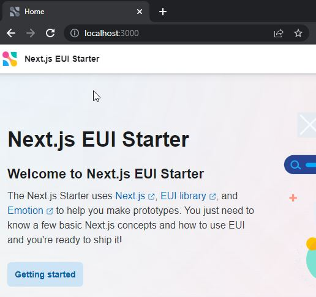
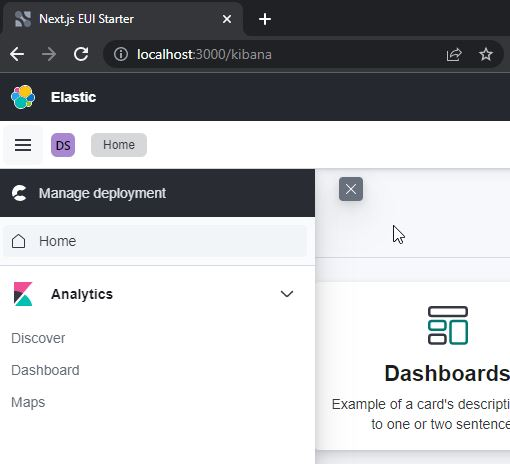
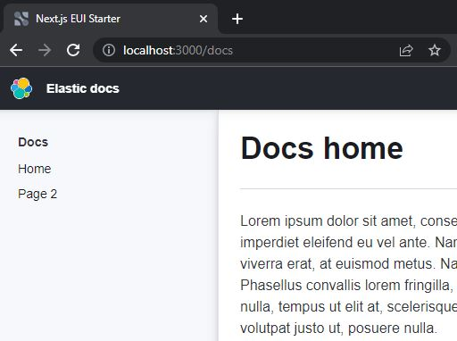

# hello.elastic-ui

Checking out [Elastic UI](https://github.com/elastic/eui)

## Getting started

## Elastic's Next.js EUI Starter

```shell
cd my-eui-starter-next
npm install
npm run dev
```







## Elastic's Gatsby EUI Starter

```shell
cd my-eui-starter-gatsby
npm install --legacy-peer-deps
npm run develop
```
